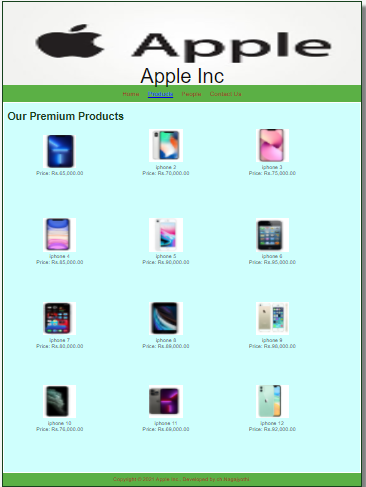

# Web Design for a Software Product Company

## AIM:

To design a static website for a software product company company.

## DESIGN STEPS:

### Step 1:

Requirement collection.

### Step 2:

Creating the layout using HTML and CSS.

### Step 3:

Updating the sample content.

### Step 4:

Choose the appropriate style and color scheme.

### Step 5:

Validate the layout in various browsers.

### Step 6:

Validate the HTML code.

### Step 6:

Publish the website in the given URL.

## PROGRAM :
```
### Home Page:

<!DOCTYPE html>
<html lang="en">
  <head>
    <title>Apple Inc</title>
    <link rel="stylesheet" href="./css/layout.css" />
    <link rel="icon" href="./img/icon.png" type="image/x-icon" />
  </head>

  <body>
    <div class="container">
      <div class="banner">Apple Inc.</div>
      <div class="menu">
        <div class="menuitemselected"><a href="/static/home.html">Home</a></div>
        <div class="menuitem"><a href="/static/products.html">Products</a></div>
        <div class="menuitem"><a>People</a></div>
        <div class="menuitem"><a>Contact Us</a></div>
      </div>
      <div class="content">
        <div class="homecontent">
          <h1>About Us</h1>
          
          <div class="contenttext">
            Founded in a garage in 1976 by Steve Jobs, Steve Wozniak, and Ronald Wayne,
            Apple began as a personal computer pioneer that today makes everything from
            laptops to portable media players. Headquartered in Cupertino, California,
            the consumer electronics giant entered the smartphone market with the iPhone
            in 2007, and the tablet market with the iPad in 2010, and the smartwatch market
            with the Apple Watch in 2014. Apple's latest mobile launch is the iPhone 13 
            Pro Max. The mobile was launched in 14th September 2021. The phone comes with
            a 6.70-inch touchscreen display with a resolution of 1284 pixels by 2778 pixels
            at a PPI of 458 pixels per inch.
            <br />
            The iPhone 13 Pro Max is a dual SIM (GSM and GSM) mobile that accepts Nano-SIM
            and eSIM. Connectivity options include Wi-Fi, GPS, Bluetooth, NFC, Lightning,
            3G and 4G (with support for Band 40 used by some LTE networks in India).
            Sensors on the phone include 3D face recognition, Compass Magnetometer,
             Proximity sensor, Accelerometer, Ambient light sensor, Gyroscope and Barometer.
            <ul>
              <li>Simple to learn, easier to use</li>
              <li>Insightful , actionable & customizable reports</li>
              <li>Anywhere, anytime and secure access</li>
            </ul>
          </div>
        </div>
      </div>
      <div class="footer">
        Copyright &#169; 2021 Apple Inc, Developed by ch.nagajyothi.
      </div>
    </div>
  </body>
</html>

### Product Page:

<!DOCTYPE html>
<html lang="en">
  <head>
    <title>Apple Inc</title>
    <link rel="stylesheet" href="./css/layout.css" />
    <link rel="icon" href="./img/icon.png" type="image/x-icon" />
  </head>

  <body>
    <div class="container">
      <div class="banner">Apple Inc</div>
      <div class="menu">
        <div class="menuitem"><a href="/static/home.html">Home</a></div>
        <div class="menuitemselected">
          <a href="/static/products.html">Products</a>
        </div>
        <div class="menuitem"><a>People</a></div>
        <div class="menuitem"><a>Contact Us</a></div>
      </div>
      <div class="content">
        <div class="productcontent">    
          <h1>Our Premium Products</h1>
          <div class="productitems">
              <div class="productitem"> 
                  <div class="itemimage">
                  
                  </div>
                  <div class="itemname"iphone 1></div>
                  <div class="itemprice">Price: Rs.65,000.00 </div>
              </div>
              <div class="productitem"> 
                  <div class="itemimage">
                  
                  </div>
                  <div class="itemname">iphone 2</div>
                  <div class="itemprice">Price: Rs.70,000.00 </div>
              </div>
              <div class="productitem"> 
                <div class="itemimage">
                
                </div>
                <div class="itemname">iphone 3</div>
                <div class="itemprice">Price: Rs.75,000.00 </div>
            </div> 
            <div class="productitem"> 
                <div class="itemimage">
                
                </div>
                <div class="itemname">iphone 4</div>
                <div class="itemprice">Price: Rs.85,000.00 </div>
              </div>
              <div class="productitem"> 
                <div class="itemimage">
                
                </div>
                <div class="itemname">iphone 5</div>
                <div class="itemprice">Price: Rs.90,000.00 </div>
            </div>
            <div class="productitem"> 
              <div class="itemimage">
              
              </div>
              <div class="itemname">iphone 6</div>
              <div class="itemprice">Price: Rs.95,000.00 </div>
          </div>
          <div class="productitem"> 
            <div class="itemimage">
            
            </div>
            <div class="itemname">iphone 7</div>
            <div class="itemprice">Price: Rs.80,000.00 </div>
        </div>
        <div class="productitem"> 
          <div class="itemimage">
          
          </div>
          <div class="itemname">iphone 8</div>
          <div class="itemprice">Price: Rs.89,000.00 </div>
      </div>              <div class="productitem"> 
        <div class="itemimage">
        
        </div>
        <div class="itemname">iphone 9</div>
        <div class="itemprice">Price: Rs.98,000.00 </div>
    </div>
    <div class="productitem"> 
      <div class="itemimage">
      
      </div>
      <div class="itemname">iphone 10</div>
      <div class="itemprice">Price: Rs.76,000.00 </div>
  </div>
  <div class="productitem"> 
    <div class="itemimage">
    
    </div>
    <div class="itemname">iphone 11</div>
    <div class="itemprice">Price: Rs.69,000.00 </div>
</div>
<div class="productitem"> 
  <div class="itemimage">
  
  </div>
  <div class="itemname">iphone 12</div>
  <div class="itemprice">Price: Rs.92,000.00 </div>
</div>
          </div>
          </div>        
      </div>
      <div class="footer">
        Copyright &#169; 2021 Apple Inc., Developed by ch.Nagajyothi.
      </div>
    </div>
  </body>
</html>

### People Page:
<!DOCTYPE html>
<html lang="en">
  <head>
    <title>Apple Inc</title>
    <link rel="stylesheet" href="./css/layout.css" />
    <link rel="icon" href="./img/icon.png" type="image/x-icon" />
  </head>

  <body>
    <div class="container">
      <div class="banner">Apple Inc</div>
      <div class="menu">
        <div class="menuitem"><a href="/static/home.html">Home</a></div>
        <div class="menuitem">
          <a href="/static/products.html">Products</a>
        </div>
        <div class="menuitemselected"><a href="/static/people.html">People</a></div>
        <div class="menuitem"><a>Contact Us</a></div>
      </div>
      <div class="content">
        <div class="productcontent">    
          <h1>Meet Our Team</h1>
          <table>
            <tr> 
            <td>
              <div class="productitem"> 
                  <div class="itemimage">
                  
                  </div>
                  <div class="itemname">Lisa Su </div> <br>
                  <div class="itemprice"> CEO  </div> 
                </td>
            <td>
                <div class="productitem"> 
                    <div class="itemimage">
                    
                    </div>
                    <div class="itemname"> Karen Lynch </div> <br>
                    <div class="itemprice">Managing Director</div>
                </td>
                <td>
                    <div class="productitem"> 
                        <div class="itemimage">
                        
                        </div>
                        <div class="itemname">Dilip</div> <br>
                        <div class="itemprice">Project Director</div>

                </td>  
            </tr>
            <tr>
                <td>
                    <div class="productitem"> 
                        <div class="itemimage">
                        
                        </div>
                        <div class="itemname">Barry Leo</div> <br>
                        <div class="itemprice">Senior Manager</div>
                    </td>
                    <td>
                        <div class="productitem"> 
                            <div class="itemimage">
                            
                            </div>
                            <div class="itemname">Safra Catz</div><br>
                            <div class="itemprice"> Manager</div>

                    </td>
                    <td>
                        <div class="productitem"> 
                            <div class="itemimage">
                            
                            </div>
                            <div class="itemname">David Hason</div> <br>
                            <div class="itemprice">Senior Team Leader</div>
                    </td>

            </tr>    
            </table>
            </div>
            </div>
        </body>
        </html>
  ### Contact us page:
  <!DOCTYPE html>
<html lang="en">
  <head>
    <title>Apple Inc</title>
    <link rel="stylesheet" href="./css/layout.css" />
    <link rel="icon" href="./img/icon.png" type="image/x-icon" />
  </head>

  <body>
    <div class="container">
      <div class="banner">Apple Inc</div>
      <div class="menu">
        <div class="menuitem"><a href="/static/home.html">Home</a></div>
        <div class="menuitem">
          <a href="/static/products.html">Products</a>
        </div>
        <div class="menuitem"><a href="/static/people.html">People</a></div>
        <div class="menuitemselected"><a href="/static/contactus.html">Contact Us</a></div>
      </div>
      <div class="contactus" background-image="url(/static/img/cbg.jpg")>
          OFFICE ADDRESS <br>
          <hr style="height:2px;border-width:5px;color:#e6752f;background-color: #e6752f">
          
          806v, 
          Marque Estate,<br>
          Chennai,<br>
          76009,<br>
          India<br>

          CONTACT ADDRESS<br>
          <hr style="height:2px;border-width:5px;color:#e6752f;background-color: #e6752f">
          
          Tel: 044-87635421
               044-87635422
          Fax: 0091-67-6784890
          E-mail: Wcrft4528@manufav.com
          <br>
           For Service Queries or Complaints: sales.wc@Service.com
        
        </div>
        <div class="footer">
            Copyright &#169; 2021 WeCraft, Developed by ch.Nagajyothi.
          </div>

      </div>
      </body>
      </html>
```
### OUTPUT:

### HOME PAGE:


### PRODUCT PAGE:



### PEOPLE PAGE:


### CONTACT US PAGE:


## Result:

Thus a website is designed for the software product company and the HTML,CSS code are validated.
